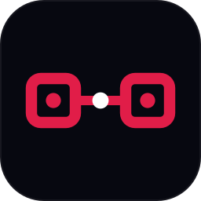

# Relay

Relay is an Electron desktop command center for operations teams managing people, systems, and incident bridge communications.

   

## Snapshot

- Local-first data model with atomic JSON writes and live file-watcher sync
- Typed IPC contracts with Zod validation and a context-isolated preload bridge
- Scales to large directories via virtualization and lazy tab loading
- Security-first desktop posture: CSP, webview allowlists, path validation, encrypted credentials
- Full quality workflow: linting, tests, formatting, and release packaging

## Preview



## Core Features

- Compose bridge communication lists from contacts/groups and copy instantly
- On-call board with drag-and-drop team/role scheduling and popout support
- Searchable People and Servers directories with notes and quick actions
- Weather dashboard with alerts, saved locations, and embedded live radar
- Sandboxed AI chat webviews with isolated session behavior
- Global productivity layer: command palette, shortcuts help, import/export manager, toasts

## Architecture

- `src/main/`: IPC handlers, file/data services, business operations
- `src/preload/`: typed `window.api` bridge via context isolation
- `src/renderer/`: React tabs, hooks, and shared UI components
- `src/shared/`: IPC contracts, validation schemas, shared domain types

Business logic stays in operations modules; handlers validate and delegate.

## Tech Stack

| Layer          | Technology                                      |
| -------------- | ----------------------------------------------- |
| Desktop shell  | Electron 40                                     |
| Frontend       | React 19 + TypeScript 5.9                       |
| Build          | Vite 7 + electron-vite 5                        |
| Validation     | Zod 4                                           |
| Virtualization | react-window 2 + react-virtualized-auto-sizer 2 |
| Drag and drop  | @dnd-kit/core + @dnd-kit/sortable               |
| Testing        | Vitest 4 + Playwright                           |

## Quick Start

```bash
npm install
npm run dev
```

## Quality and Testing

```bash
npm run typecheck
npm run lint
npm test
npm run test:electron
```

Coverage thresholds are enforced:

- Main/shared: lines 52%, functions 52%, branches 38%, statements 52%
- Renderer: lines 78%, functions 76%, branches 67%, statements 79%

## Security and Reliability

- Context isolation and sandbox enabled
- Renderer has no direct Node.js/Electron access
- Strict CSP and allowlisted HTTPS webviews
- Navigation and `window.open` interception
- Path traversal checks on file operations
- Credential handling in main process with Electron `safeStorage`

## Project Layout

- `src/main/operations/`: core data and business logic
- `src/main/handlers/`: IPC handler registration and validation
- `src/renderer/src/tabs/`: feature tabs (Compose, On-Call, People, Servers, Weather, Radar, AI)
- `src/renderer/src/hooks/`: feature-focused state and orchestration hooks
- `docs/`: architecture, development, logging, troubleshooting, design notes

## License

MIT
