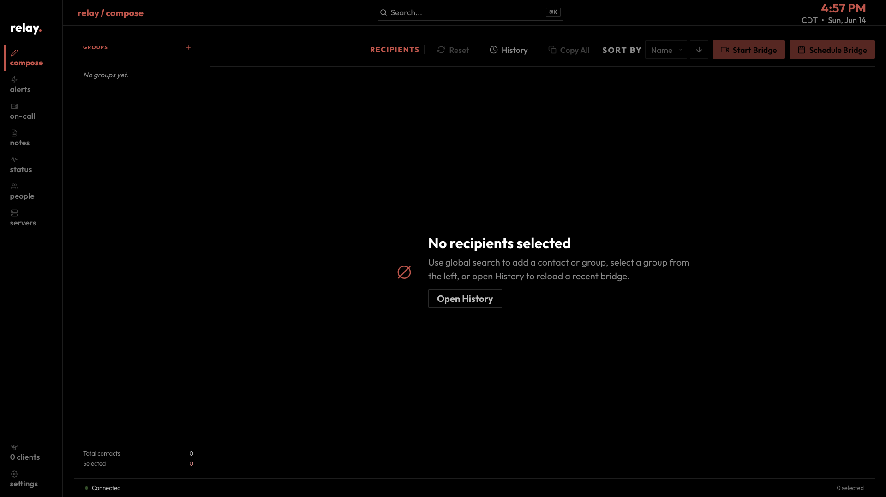
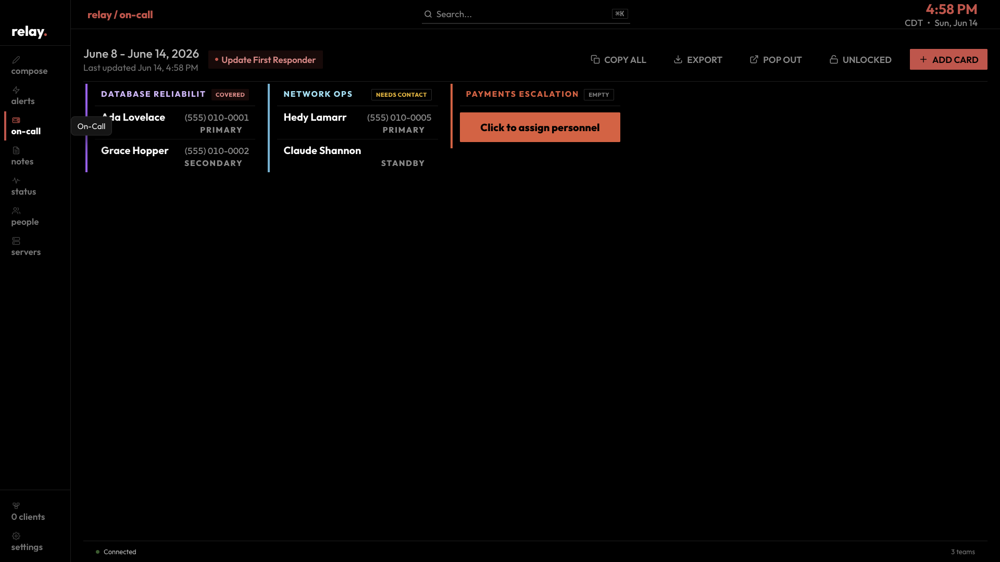

# Relay

Relay is an Electron desktop command center for operations teams managing people, systems, and incident bridge communications.

   

## Snapshot

- Embedded PocketBase with offline-first cache and realtime sync
- Typed IPC contracts with Zod validation and a context-isolated preload bridge
- Scales to large directories via virtualization and lazy tab loading
- Security-first desktop posture: CSP, webview allowlists, path validation, encrypted credentials
- Full quality workflow: linting, type checking, tests, and CI release packaging

## Preview

| Compose                                      | On-Call Board                               |
| -------------------------------------------- | ------------------------------------------- |
|  |  |

## Core Features

- **Compose** — Build bridge communication lists from contacts and groups, copy to clipboard instantly
- **On-Call Board** — Drag-and-drop team/role scheduling with week navigation and popout display mode
- **People & Servers** — Searchable directories with inline notes, tags, and quick-action menus
- **Weather** — Live conditions, NWS alerts, saved locations, and an embedded radar tab
- **Alerts** — Build and capture alert cards with severity levels, compact/enhance text processing, highlight colors, event time banners, and screenshot capture
- **Notes** — Create, edit, reorder, and tag standalone notes with rich content parsing and color coding
- **Cloud Status** — Monitor cloud provider status pages (AWS, Azure, M365, GitHub, Cloudflare, Google Cloud, Claude, ChatGPT, Salesforce)
- **Global Layer** — Command palette, keyboard shortcuts modal, import/export manager, backup/restore, toast notifications

## Architecture

- `src/main/`: IPC handlers, PocketBase services, offline cache, and business logic
- `src/preload/`: typed `window.api` bridge via Electron context isolation
- `src/renderer/`: React tabs, feature-focused hooks, and shared UI components
- `src/shared/`: IPC channel contracts, Zod validation schemas, and domain types

Handlers validate inputs and delegate to service/utility modules for business logic.

## Tech Stack

| Layer          | Technology                                      |
| -------------- | ----------------------------------------------- |
| Desktop shell  | Electron 41                                     |
| Frontend       | React 19 + TypeScript 6.0                       |
| Build          | Vite 7 + electron-vite 5                        |
| Database       | PocketBase 0.26 (embedded SQLite)               |
| Validation     | Zod 4                                           |
| Virtualization | react-window 2 + react-virtualized-auto-sizer 2 |
| Drag and drop  | @dnd-kit/core + @dnd-kit/sortable               |
| Testing        | Vitest 4 + Playwright                           |

## Quick Start

```bash
npm install
npm run dev
```

## Quality and Testing

```bash
npm run typecheck   # TypeScript strict mode
npm run lint        # ESLint
npm test            # Vitest unit tests
npm run test:electron  # Playwright integration tests
```

Coverage thresholds are enforced:

- Main/shared: lines 80%, functions 80%, branches 80%, statements 80%
- Renderer: lines 80%, functions 80%, branches 80%, statements 80%

## Security

- Context isolation and OS-level sandbox enabled on all renderer processes
- Renderer has no direct Node.js or Electron API access
- Strict CSP headers and HTTPS-only webview allowlists
- Navigation and `window.open()` interception on all windows
- Path traversal checks on all file system operations
- Credential handling delegated to main process via Electron `safeStorage`

## Project Layout

- `src/main/handlers/`: IPC handler registration, input validation, and business logic
- `src/renderer/src/tabs/`: feature tabs (Compose, Alerts, On-Call, People, Servers, Weather, Radar, Notes, Cloud Status)
- `src/renderer/src/tabs/alerts/`: alert sub-components (severity selector, body editor, compact/enhance engines, highlight colors, event time banner)
- `src/renderer/src/tabs/notes/`: note sub-components (card, editor, toolbar, content parser/renderer)
- `src/renderer/src/hooks/`: feature-focused state and side-effect hooks
- `src/main/handlers/cloudStatus/`: cloud status provider fetchers (Google, AWS/Azure/GitHub/Cloudflare via RSS, Salesforce, Statuspage)
- `src/main/handlers/backupHandlers.ts`: PocketBase backup create/restore with cache invalidation
- `docs/`: architecture, development guide, design system, security

## License

MIT
