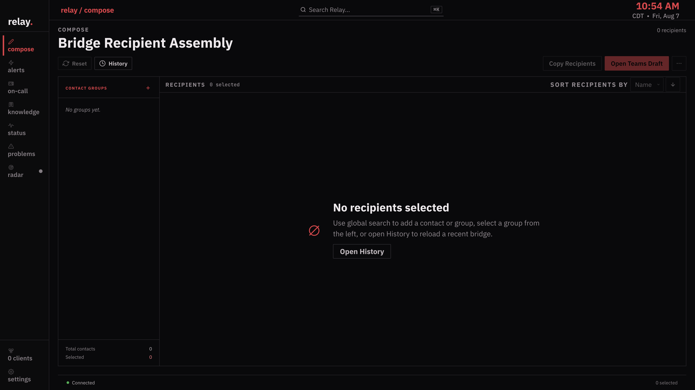
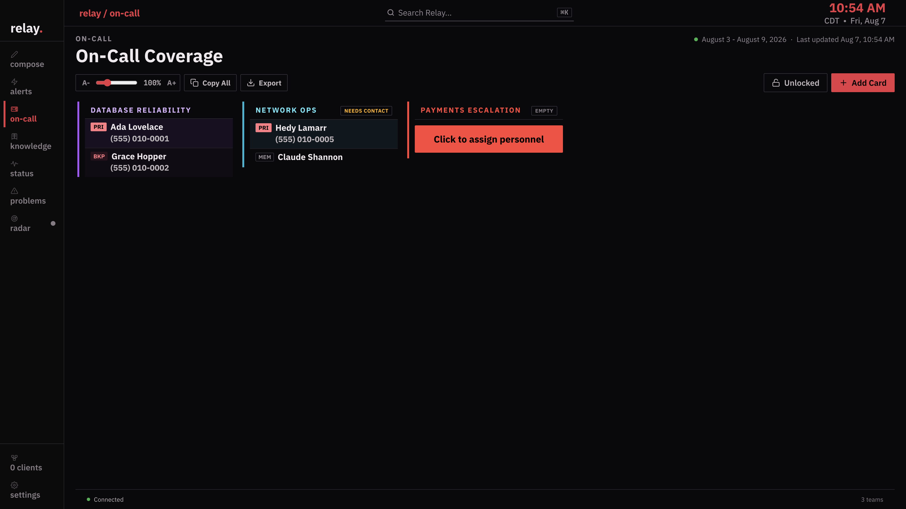
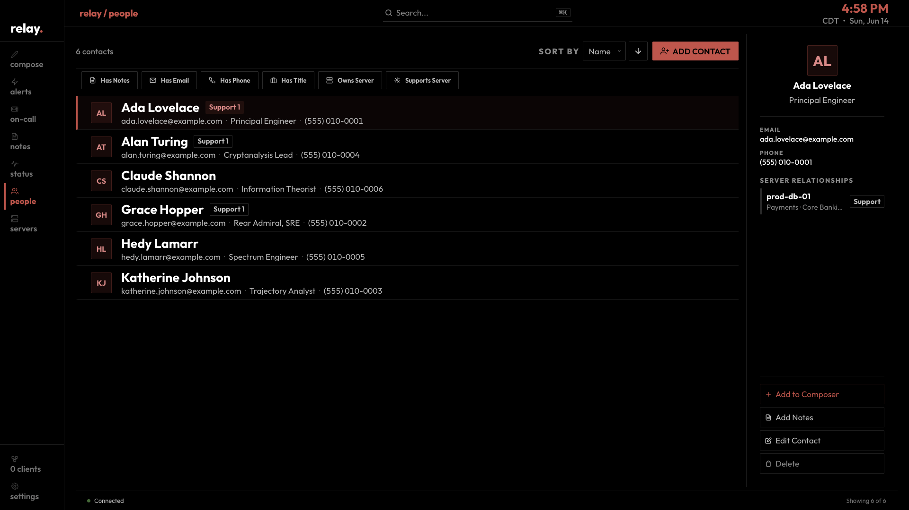
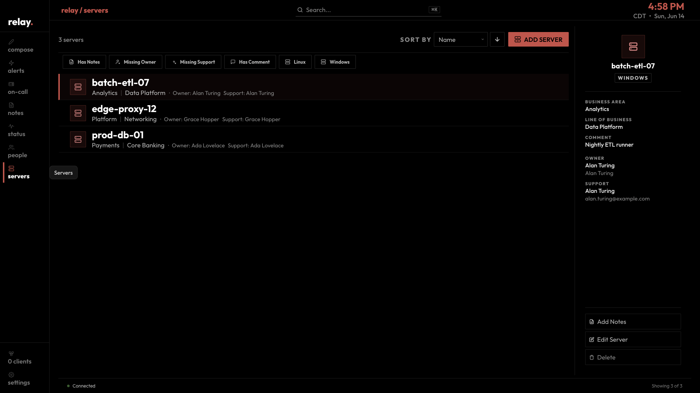
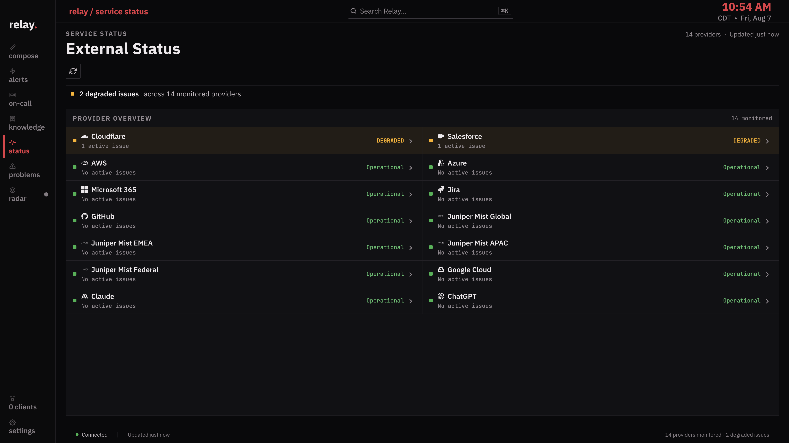
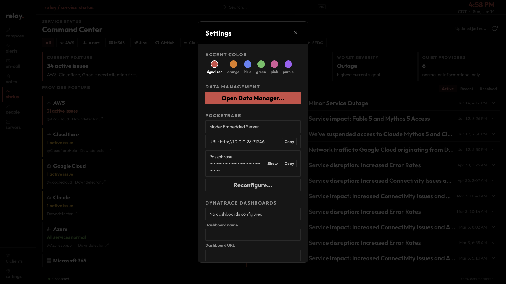
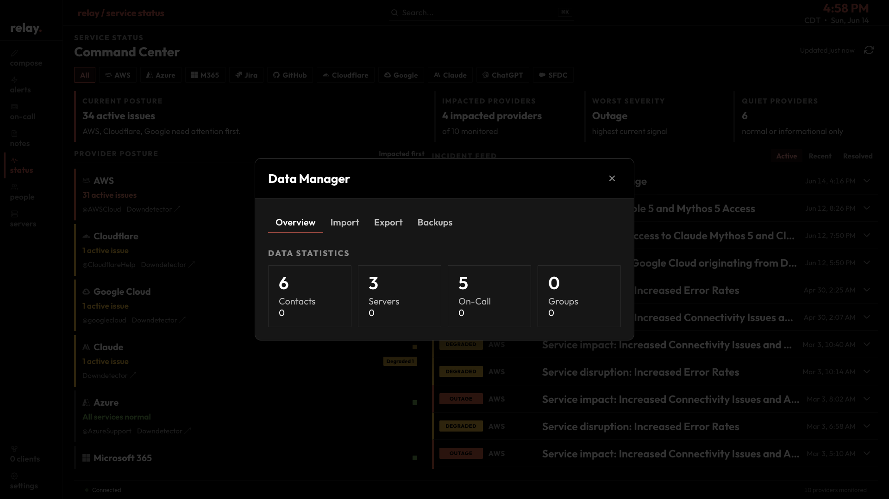
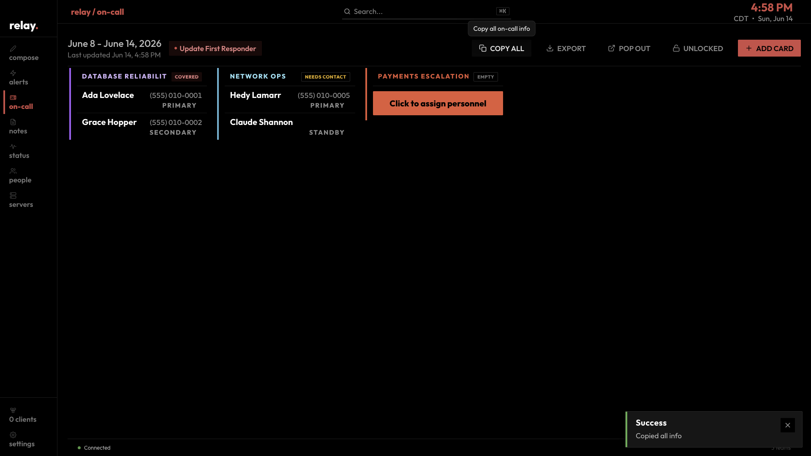
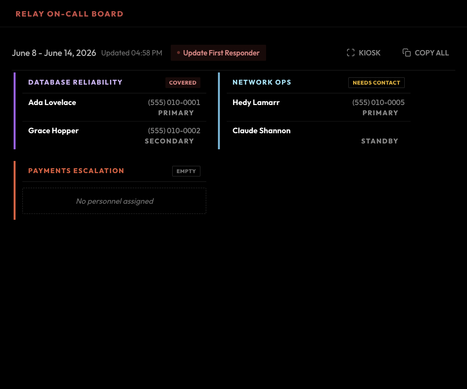

# Relay

Relay is an Electron desktop command center for operations teams managing contacts, systems, on-call schedules, service health, and incident communications.

Relay releases are distributed for Windows. macOS remains supported as a local development host.

   

## Snapshot

- Embedded PocketBase server/client mode with local-first storage and realtime sync
- Typed preload bridge with Zod-validated IPC contracts
- Top-level workspaces for Compose, Alerts, On-Call, Knowledge, Status, and Dynatrace Problems, with Settings in the sidebar footer
- Sidebar client presence, connect toasts, and a unified connected/cached/offline indicator
- LAN/VPN-only browser backup for desktop Chrome, Edge, and Safari
- Dynatrace dashboard launcher with Relay-styled popout windows and isolated SSO session storage
- Electron hardening with context isolation, sandboxing, CSP, path validation, and domain-gated external navigation

## Preview

| Compose                                      | On-Call Board                               | Contacts                                 |
| -------------------------------------------- | ------------------------------------------- | ---------------------------------------- |
|  |  |  |

| Servers                                      | Service Status                                       | Settings and connections                              |
| -------------------------------------------- | ---------------------------------------------------- | ----------------------------------------------------- |
|  |  |  |

| Data Manager                                       | Notifications                                     | On-Call Popout                                        |
| -------------------------------------------------- | ------------------------------------------------- | ----------------------------------------------------- |
|  |  |  |

## Core Features

- **Compose**: Build bridge communication lists from contacts and saved groups, then start or schedule the bridge
- **Alerts**: Compose styled incident cards, apply severity formatting, schedule reminders, and capture them to disk or clipboard
- **On-Call Board**: Manage team and role coverage with drag-and-drop scheduling, lock control, export/copy tools, and popout support
- **Knowledge**: Browse the shared Wiki, Contacts, and Servers from one workspace; search server-managed PDF guides and cache opened documents for desktop offline reading
- **Service Status**: Monitor provider incident feeds across major cloud and SaaS vendors
- **Dynatrace Problems**: Review synchronized Problems, filter by alerting profile, record local dispositions and ticket references, and open the source Problem in Dynatrace
- **Relay Web Backup**: Use the shared Relay workspace from a supported desktop browser on the trusted LAN or VPN
- **Client Presence**: Show connected Relay clients in server mode, list hostnames on hover, and notify when clients connect
- **Dynatrace Dashboards**: Save Dynatrace dashboard URLs in Settings, launch them from the sidebar, support Microsoft SSO, and clear the dashboard session when needed
- **Data Management**: Export, import, reset, and restore Relay data from the Settings page

## Wiki administration

Wiki reading is available during ordinary Relay use. An Owner or Administrator creates and assigns the single protected Publisher account under **Settings → Administration → Accounts & roles**. Owners, Administrators, and the assigned Publisher can open **Manage Wiki** on the server, a paired Relay Desktop client, or Relay Web.

See [Wiki administration](docs/knowledge-base.md) for publishing, links, queue recovery, retention, and the unique-filename rule.

## Docs

- [Documentation index](docs/README.md): live guides, supporting assets, and historical material
- [Architecture](docs/architecture.md): runtime model, data flow, and subsystem layout
- [Development](docs/DEVELOPMENT.md): service patterns, hooks, testing, and contributor conventions
- [Design](docs/DESIGN.md): current renderer styling and component conventions
- [Wiki administration](docs/knowledge-base.md): Publisher workflow, document linking, retention, and recovery
- [Relay Web](docs/relay-web.md): browser support, setup, feature boundaries, notifications, and network safety
- [Security](docs/SECURITY.md): trust boundaries, hardening, validation, and secret handling

## Quick Start

Requires Node.js 22 and npm.

```bash
npm ci
npm run dev
```

## Common Commands

```bash
npm run typecheck
npm run lint
npm test
npm run test:electron
npm run test:web
npm run test:coverage
npm run build
```

## Screenshot Refresh

The README screenshots are generated from the Electron Playwright harness.

```bash
npm run build
npx playwright test tests/e2e/redesign-screenshots.spec.ts -c playwright.electron.config.ts
cp tmp/redesign-shots/compose.png docs/screenshots/compose.png
cp tmp/redesign-shots/oncall.png docs/screenshots/oncall.png
cp tmp/redesign-shots/people.png docs/screenshots/people.png
cp tmp/redesign-shots/servers.png docs/screenshots/servers.png
cp tmp/redesign-shots/cloud-status.png docs/screenshots/cloud-status.png
cp tmp/redesign-shots/settings-modal.png docs/screenshots/settings-modal.png
cp tmp/redesign-shots/data-manager.png docs/screenshots/data-manager.png
cp tmp/redesign-shots/toast.png docs/screenshots/toast.png
cp tmp/redesign-shots/popout.png docs/screenshots/oncall-popout.png
```

## Project Layout

- `src/main/`: Electron main process, PocketBase bootstrap, IPC handlers, cache, backups, and Dynatrace popout windows
- `src/preload/`: typed `window.api` bridge
- `src/renderer/`: React UI, hooks, services, tabs, and styles
- `src/shared/`: shared types, IPC channel definitions, validation, and utilities
- `docs/`: contributor-facing architecture, development, design, and security docs

## License

MIT
