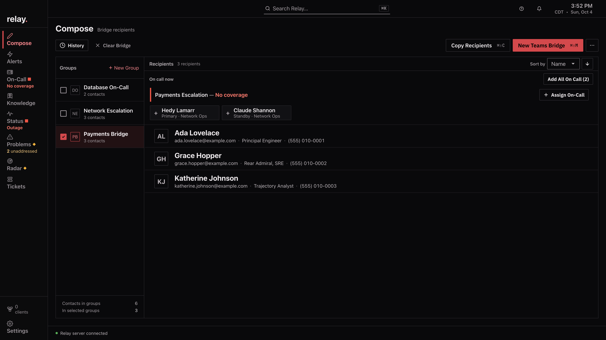
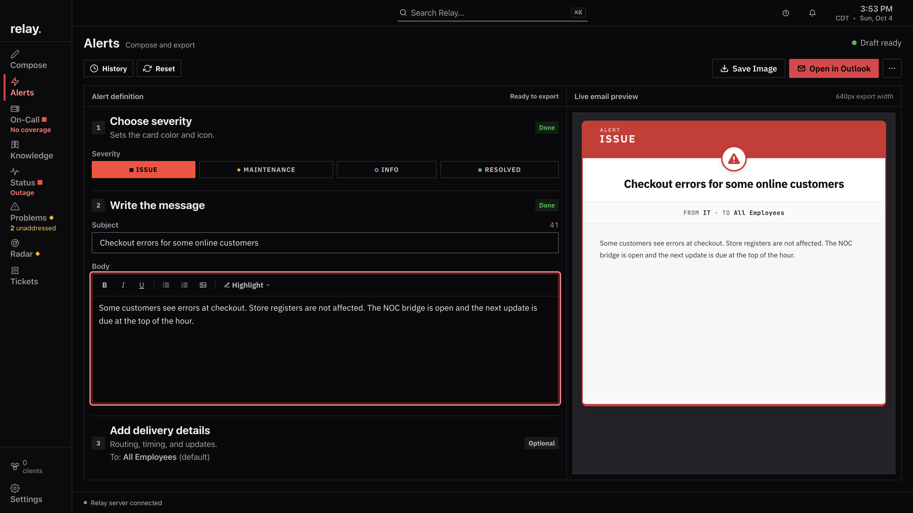
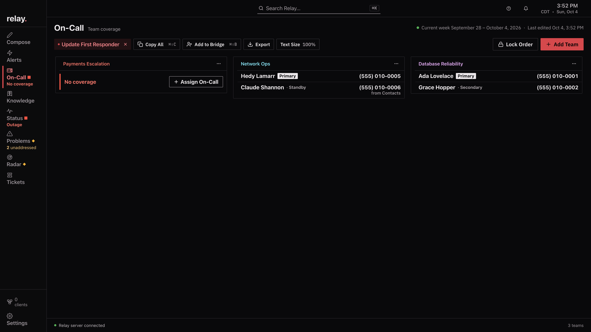
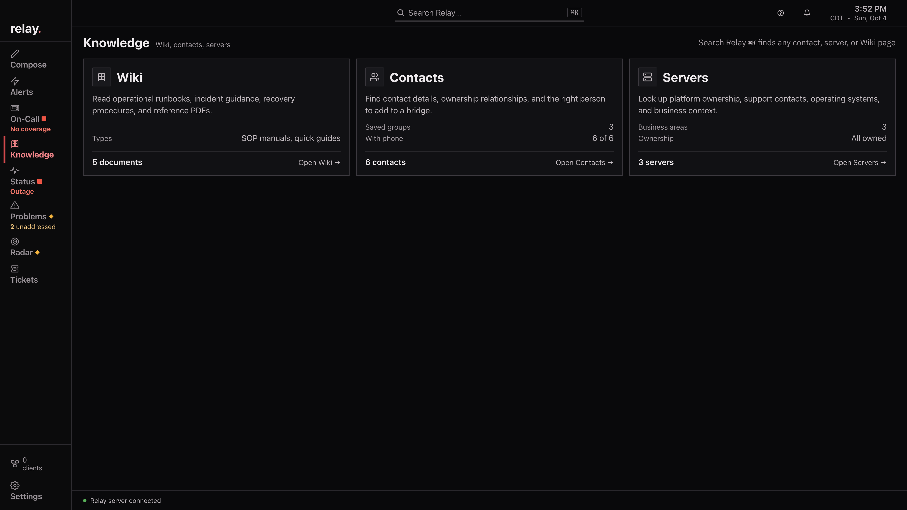
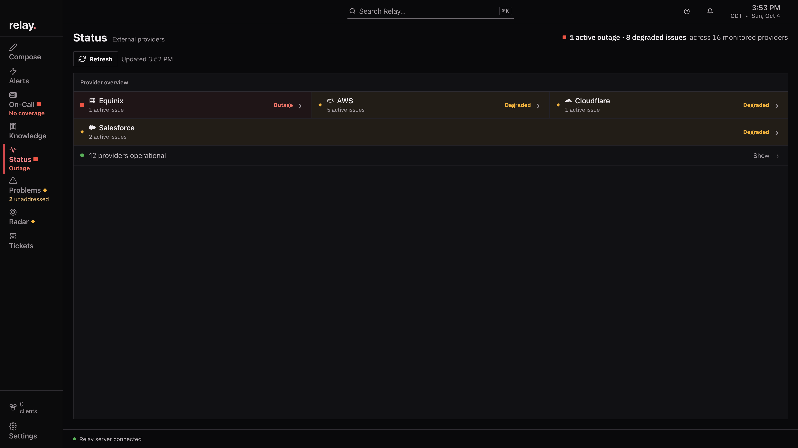
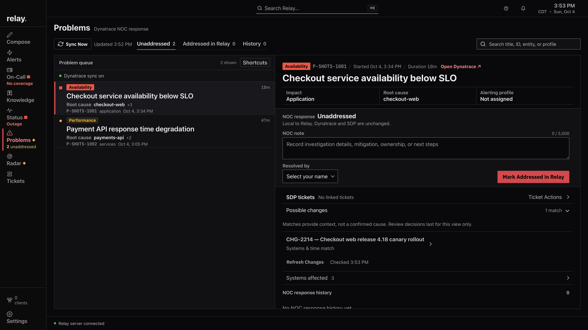
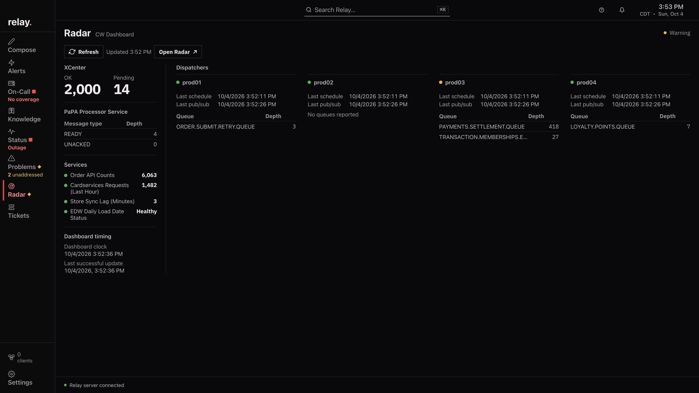
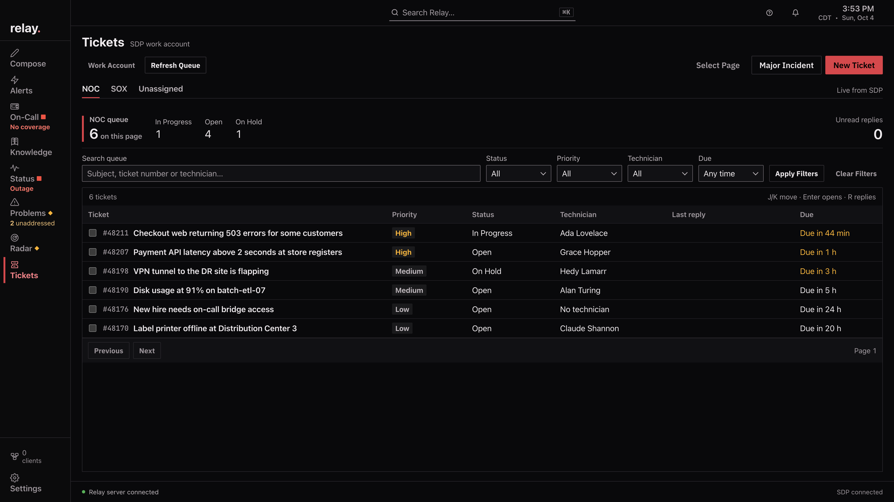

# Relay

Relay is an Electron desktop command center for operations teams: contacts, systems, on-call schedules, service health, tickets, and incident communications.

Releases ship for Windows x64. macOS is supported as a local development host.

   

## Download

[Download the latest Windows release](https://github.com/CrimsonSoul/Relay/releases/latest). Each
release contains a ZIP with the Windows x64 installer (`Relay.exe`) and the ZIP's SHA-256 checksum.
Updater-capable builds walk through separate Download, Install, and Restart steps in the app; older
builds must install the first updater-capable release from GitHub once.

Release executables are not Windows publisher-signed. The in-app updater verifies the fixed GitHub
repository, immutable release metadata, GitHub's asset digest, and the published checksum, but that
trust model is not a substitute for Authenticode publisher identity.

## Preview

| Compose                                      | Alerts                                     | On-Call                                     |
| -------------------------------------------- | ------------------------------------------ | ------------------------------------------- |
|  |  |  |

| Knowledge                                    | Service Status                                       | Problems                                                       |
| -------------------------------------------- | ---------------------------------------------------- | -------------------------------------------------------------- |
|  |  |  |

| Radar                                           | Tickets                                      |
| ----------------------------------------------- | -------------------------------------------- |
|  |  |

## Workspaces

- **Compose**: build bridge recipient lists from contacts and saved groups, then copy recipients, prepare a Teams bridge draft, or create a calendar invite
- **Alerts**: compose styled incident cards with severity formatting and reminders, then capture them to disk or the clipboard
- **On-Call**: manage team and role coverage with drag-and-drop scheduling, lock control, export and copy tools, board text sizing, and popout support
- **Knowledge**: browse the shared Wiki, Contacts, and Servers in one workspace; search server-managed PDF guides and keep opened documents for offline desktop reading. Publishing is limited to Owners, Administrators, and the assigned Publisher; see [Wiki administration](docs/knowledge-base.md)
- **Status**: monitor provider incident feeds across major cloud and SaaS vendors
- **Problems**: review synchronized Dynatrace Problems, scope the feed by alerting profile or a custom DQL expression, record local dispositions and ticket references, see correlated SDP Changes, and open the source Problem in Dynatrace
- **Radar**: review the Relay server's validated dispatch, queue, service, and dashboard-timing snapshot without exposing the CW Dashboard session to clients
- **Tickets**: work ServiceDesk Plus requests live with native Relay controls, signed in with each operator's own SDP work account through the Relay server

## Across the App

- **Server and client mode**: embedded PocketBase with local-first storage, realtime sync, and a unified connected, cached, or offline indicator
- **Client presence**: the server shows connected clients, lists their hostnames on hover, and announces new connections
- **Notification center**: one header inbox for ticket, Dynatrace, Radar, and service-status notices, with shared quiet hours and snooze; history is session-only
- **Relay Web**: the shared workspace in desktop Chrome, Edge, or Safari, limited to a trusted LAN or VPN
- **Dynatrace dashboards**: launch saved dashboards from the sidebar in Relay-styled popout windows with Microsoft SSO and isolated session storage
- **Data management**: export, import, reset, and restore Relay data from Settings
- **Workstation keep-awake**: keep a Windows display active and prevent ordinary inactivity locks while Relay runs, without administrator access
- **Hardening**: context isolation, sandboxing, CSP, Zod-validated IPC, path validation, and domain-gated external navigation

## Docs

The [documentation index](docs/README.md) lists the living guides:

- [Architecture](docs/architecture.md): runtime model, data flow, and subsystem layout
- [Development](docs/DEVELOPMENT.md): service patterns, hooks, testing, releases, and contributor conventions
- [Design](docs/DESIGN.md): renderer styling and component conventions
- [Wiki administration](docs/knowledge-base.md): Publisher workflow, document linking, retention, and recovery
- [Relay Web](docs/relay-web.md): browser support, setup, feature boundaries, notifications, and network safety
- [Security](docs/SECURITY.md): trust boundaries, hardening, validation, and secret handling

## Development

Requires Node.js 22.23.2 LTS (see `.node-version`) and npm.

```bash
npm ci
npm run dev
```

Checks:

```bash
npm run typecheck
npm run lint
npm run format:check
npm test
npm run test:electron
npm run test:web
npm run build
```

### Screenshot refresh

The preview screenshots come from the Electron Playwright harness (`test:electron` builds first):

```bash
RELAY_CAPTURE_SCREENSHOTS=1 npm run test:electron -- tests/e2e/redesign-screenshots.spec.ts
for shot in compose alerts oncall knowledge cloud-status dynatrace-problems radar tickets; do
  cp "tmp/redesign-shots/$shot.png" "docs/screenshots/$shot.png"
done
```

### Project layout

- `src/main/`: Electron main process, PocketBase bootstrap, IPC handlers, cache, backups, and popout windows
- `src/preload/`: typed `window.api` bridge
- `src/renderer/`: React UI, hooks, services, tabs, and styles
- `src/shared/`: shared types, IPC channel definitions, validation, and utilities
- `docs/`: living architecture, development, design, and security guides

## License

MIT
